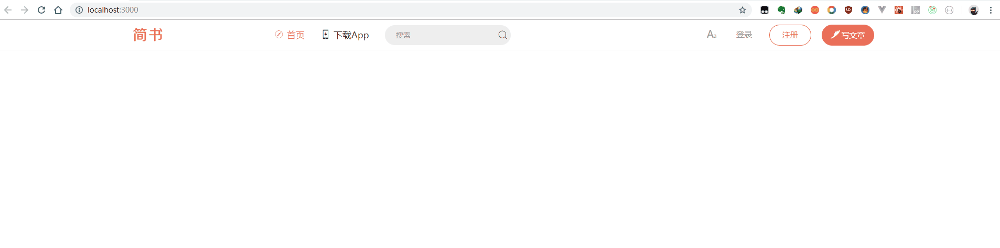

# React简书流程
## Install
```bash
npm i --save
npm i react-router-dom --save
```
## Demo
# 一.Header部分
1. 初始化项目：
```bash
create-react-app react-jianshu
```
2. 安装样式管理工具(有效避免样式相互影响)
```
yarn add styled-components
```
- 重置样式：[ResetCSS](https://meyerweb.com/eric/tools/css/reset/)

3. 使用 redux/ react-redux进行数据管理
- ## redux
  store  action  reducer

  `API`：createStore()、store.getState()、store.dispatch()、store.subscribe()
- ## react-redux
  
  mapStatetoProps、mapDispatchToProps

  `API`：Provider、connect


4. immutable库防止state被意外修改
```
set()方法结合之前的immutable的值与设置值，返回一个新对象
get()方法，获取fromJS对象里的属性
使用immuta要注意数据格式的统一（普通数组、对象使用fromJS转为immutable数组、对象）
```

### 进度
- ## 完善详情页，登录等(11.14)

- ## 首页-动画(11.09)

- ## 标签、列表(11.06-11.08)

- ## Header布局+搜索框(11.03-11.05)

