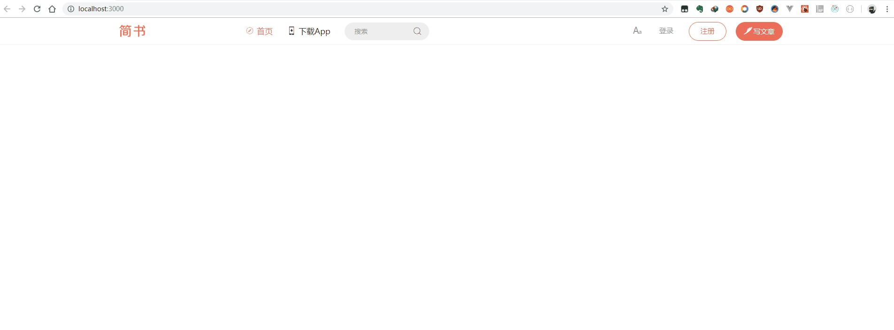

# React简书流程
# 一.Header部分
1. 初始化项目：
```bash
create-react-app react-jianshu
```
2. 安装样式管理工具(有效避免样式相互影响)
```
yarn add styled-components
```
- 重置样式：[ResetCSS](https://meyerweb.com/eric/tools/css/reset/)

3. 使用 redux/ react-redux进行数据管理

4. immutable库防止state被意外修改

### 进度(11.03-11.04)
1. 搜索框动画

